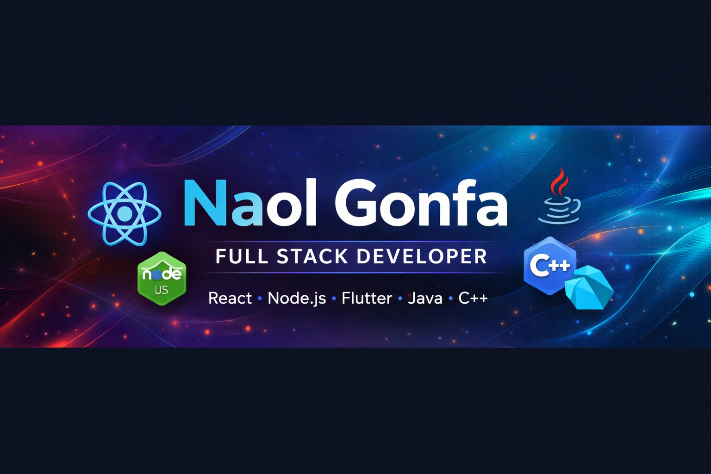

<h1 align="center">
</h1>

# 🧠 About Me

I am a dedicated **Computer Science student** with strong discipline and hands-on project experience.

I specialize in:

✔ Full Stack Web Development
✔ Flutter Mobile App Development
✔ Database Design & Schema Architecture
✔ Clean Code & Structured System Design

I focus on building **scalable real-world systems that solve meaningful problems.**

> *“Consistency builds mastery.”*

---
## 🐍 Contribution Snake

# 🛠 Tech Stack

### 💻 Languages

### 🌐 Frontend

### ⚙ Backend

### 📱 Mobile

### 🗄 Database

### 🧩 Core Knowledge

---

# 📊 GitHub Stats

---

# 📈 Contribution Activity

---

# 🌟 Featured Projects

## 🧠 DebugSense AI – Smart Error Explainer

🔗 GitHub: [DebugSense AI](https://github.com/Naol724/Debugsenser-ai)
🌐 Live Demo: [Live Demo](https://debugsenser-ai-3.onrender.com/)

AI-powered system that explains programming errors and provides corrected code using **LLaMA-3.3-70B via Groq API**.

**Tech Stack**

  

---

## 🌦 Weather Application

🔗 GitHub: [Weather App](https://github.com/Naol724/WeatherApp)
🌐 Live Demo: [Live Demo](https://weather-app-delta-two-88.vercel.app/)

Real-time weather application using **OpenWeatherMap API** with geolocation support.

**Tech Stack**

  

---

## 🛒 React E-Commerce App (Amazon-Style)

🔗 GitHub: [React Amazon Clone](https://github.com/Naol724/React-Amazon-clone)
🌐 Live Demo: [Live Demo](https://react-ecommerce-app-24et.onrender.com/)

Full e-commerce platform with authentication, payments, and order history.

**Tech Stack**

  

---

## 🎬 Netflix Clone – React Movie App

🔗 GitHub: [React Movie App](https://github.com/Naol724/react-movie-app)
🌐 Live Demo: [Live Demo](https://movie-streaming-app-0p2g.onrender.com/)

Netflix-style streaming UI using **TMDb API** and **YouTube trailer integration**.

**Tech Stack**

  
  

---

## 📚 Library Management System

🔗 GitHub: [Library Management System](https://github.com/Naol724/Library-management-system-with-Javafx)

Desktop **Library Management System** built with **JavaFX + PostgreSQL** using MVC architecture.

**Tech Stack**

---

## 🎨 Bootstrap App Clone

🔗 GitHub: [Bootstrap App Clone](https://github.com/Naol724/Bootstrap-App-Clone)
🌐 Live Demo: [Live Demo](https://bootstrap-app-clone-1.onrender.com/)

Apple-style responsive UI built with **Bootstrap 5**.

**Tech Stack**

---

# 🎯 Current Focus

🚀 Advanced React Patterns
⚙ Backend Architecture & API Design
📱 Advanced Flutter State Management
🌍 Scalable Full Stack Applications

---

# 💼 Open To

✔ Full Stack Development
✔ Flutter Mobile Development
✔ Internship Opportunities
✔ Remote Work

---

# 📫 Connect With Me

📧 Email
[naolgonfa39@gmail.com](mailto:naolgonfa39@gmail.com)

🔗 LinkedIn
[https://www.linkedin.com/in/naol-gonfa-61b7a9363/](https://www.linkedin.com/in/naol-gonfa-61b7a9363/)

💻 GitHub
[https://github.com/Naol724](https://github.com/Naol724)

---

# 🔥 Personal Drive

I started with **limited resources but strong discipline and focus.**

I believe in:

✔ Hard Work
✔ Deep Learning
✔ Building Real Projects
✔ Continuous Growth

---

